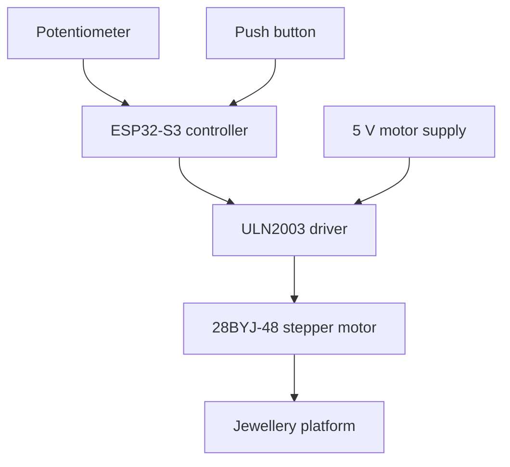

# ESP32-S3-Based Automated 180° Turntable for Jewellery Product Photography

An embedded motion-control prototype that rotates a jewellery platform through a controlled sweep to support product photography and video recording. The project combines an ESP32-S3 controller, a geared stepper motor, a ULN2003 driver, and local user controls in a compact platform.

**Author:** Shanmukh Jonnalagadda  
**Focus:** Embedded C/C++, motor control, hardware integration, and prototype development

## Overview

Small jewellery products need consistent positioning to capture their shape, finish, and details from multiple viewpoints. Manually rotating a product can introduce uneven movement and inconsistent framing.

This project automates platform rotation using a 28BYJ-48 stepper motor. A potentiometer provides speed adjustment, while a push button provides local control. The 180° sweep is the primary project configuration; 280° and full-revolution configurations were also explored during development.

The prototype automates the turntable motion. Photography and video recording are operated separately; automatic camera triggering is a future enhancement.

## Features

- ESP32-S3-based control of a 5 V geared stepper motor through a ULN2003 driver.
- Controlled angular movement for jewellery presentation and capture.
- Clockwise and counterclockwise motor operation.
- Potentiometer-based adjustment of rotation speed.
- Push-button input for local operation.
- A two-plate mechanical arrangement with the electronics beneath the rotating platform.

Exact button behavior, direction selection, and sweep sequence depend on the firmware version. A Bluetooth-enabled version was also explored; its controls and dependencies should be documented with that sketch before reuse.

## System Architecture



The controller reads the user inputs and generates the motor stepping sequence. The driver switches the motor windings, and the geared output shaft transfers motion to the platform. A separate phone or camera records the jewellery as it rotates.

## Hardware

| Component | Quantity | Purpose |
| --- | --- | --- |
| ESP32-S3-based development board | 1 | Executes the control firmware |
| 28BYJ-48, 5 V stepper motor | 1 | Rotates the platform |
| ULN2003 driver board | 1 | Interfaces the controller with the motor |
| 5 V, 2 A adapter | 1 | External motor power supply |
| 10 kΩ potentiometer | 1 | Speed input |
| Push button | 1 | Local control input |
| Breadboard and jumper wires | As needed | Prototype connections |
| USB-C data cable | 1 | Firmware upload and controller connection |
| Base, rotating plate, and mounting materials | As needed | Mechanical structure |

## Pin Connections

The following mapping uses the board labels from the prototype. Match these labels to the selected board and the pin-numbering mode used by the firmware; labels such as `D2` must not be assumed to mean raw GPIO 2.

| Signal | Controller board label |
| --- | --- |
| ULN2003 IN1 | D2 |
| ULN2003 IN2 | D3 |
| ULN2003 IN3 | D4 |
| ULN2003 IN4 | D5 |
| Potentiometer wiper | A0 |
| Push-button input | D6 |

For the analog input, connect the potentiometer's outer terminals to 3.3 V and GND. Match the button wiring to the sketch's pull-up or pull-down configuration. Power the motor through the driver using the 5 V motor supply and connect the controller and driver grounds together. Verify supply polarity before powering the prototype.

## Firmware and Motion Control

The firmware is developed in C/C++ using the Arduino environment. Its main responsibilities are:

1. Initialize the motor outputs and user inputs.
2. Read the potentiometer and button state.
3. Convert the requested sweep into a target step count.
4. Apply the motor stepping sequence in the required direction.
5. Control rotation speed through the interval between steps.
6. Complete or repeat the movement according to the selected sketch.

### Angular movement

The prototype used a nominal value of **4096 half-steps per output-shaft revolution**:

```text
target_half_steps = round(sweep_degrees × half_steps_per_revolution / 360)
```

| Requested movement | Nominal half-step count |
| --- | ---: |
| 180° | 2048 |
| 280° | 3186 |
| 360° | 4096 |

These values are configuration targets, not measured accuracy specifications. Check the actual travel on the assembled platform and adjust the calibration if needed. The step count must also match the stepping mode used in the sketch.

## Setup and Operation

1. Assemble the motor, driver, controller, potentiometer, and button using the pin mapping above and the wiring requirements of the selected sketch.
2. Secure the motor to the base and attach the platform so that it is centered over the shaft. Check that the platform can move without rubbing or tilting.
3. Open the project's `.ino` sketch in Arduino IDE.
4. Install the board support package for the exact development board and any libraries referenced by the sketch's `#include` statements.
5. Select the correct board, USB port, and pin-numbering settings.
6. Confirm the motor pin mapping, step count, rotation direction, and button configuration in the firmware.
7. Upload the sketch and test the platform without jewellery before adding a lightweight product.
8. Position the jewellery near the center, frame it with a phone or camera, and adjust lighting.
9. Use the potentiometer and the controls implemented in the sketch to operate the platform. Start recording separately on the camera.

Keep the exact board selection and library dependencies alongside the firmware when publishing it, so another user can reproduce the build.

## Prototype Development and Observations

Development included controller upload and connection troubleshooting, stepper-motor operation, direction control, potentiometer input, button control, and exploration of different sweep angles.

Full-revolution motion was observed during initial testing. The mechanical prototype also showed platform tilt or wobble, highlighting the importance of centered loading, rigid motor mounting, and platform support.

No quantitative angular-accuracy, payload-capacity, or endurance results are claimed here. Demonstration photos and videos should be used to show the actual prototype behavior.

## Repository Organization

Suggested locations for the project files are listed below. Add the corresponding files as they become available.

| Location | Contents |
| --- | --- |
| `README.md` | Project overview and operating information |
| `firmware/` | Working Arduino sketch and clearly labeled variants |
| `docs/` | Wiring diagram, component details, and project report |
| `images/` | Prototype, wiring, mounting, and product photographs |
| `demo/` | Short demonstration video, or a document linking to a hosted video |

## Limitations

- The current mechanism is a prototype, and mounting or platform imbalance can affect image stability.
- Commanded step counts do not provide independent feedback of the platform's actual angle.
- Rotation quality depends on the product load, selected speed, and mechanical assembly.
- Camera capture and lighting are controlled separately.
- Precise operating behavior and wireless features vary between firmware versions.

## Future Improvements

- Add rigid motor mounting and a bearing-supported rotating platform.
- Introduce acceleration and deceleration to improve motion transitions.
- Add a home-position sensor for a repeatable starting reference.
- Integrate high-CRI lighting for consistent product illumination.
- Implement synchronized camera triggering and step-and-capture operation.
- Refine wireless controls and document the supported commands.
- Measure angular repeatability, stable operating speeds, and practical payload limits.

## Skills Demonstrated

Embedded C/C++ programming, digital and analog I/O, stepper-motor sequencing, user-input integration, power and driver interfacing, hardware debugging, and mechanical-electrical prototype integration.

## Author

**Shanmukh Jonnalagadda**  
Master's student in Electrical and Computer Engineering, George Mason University
