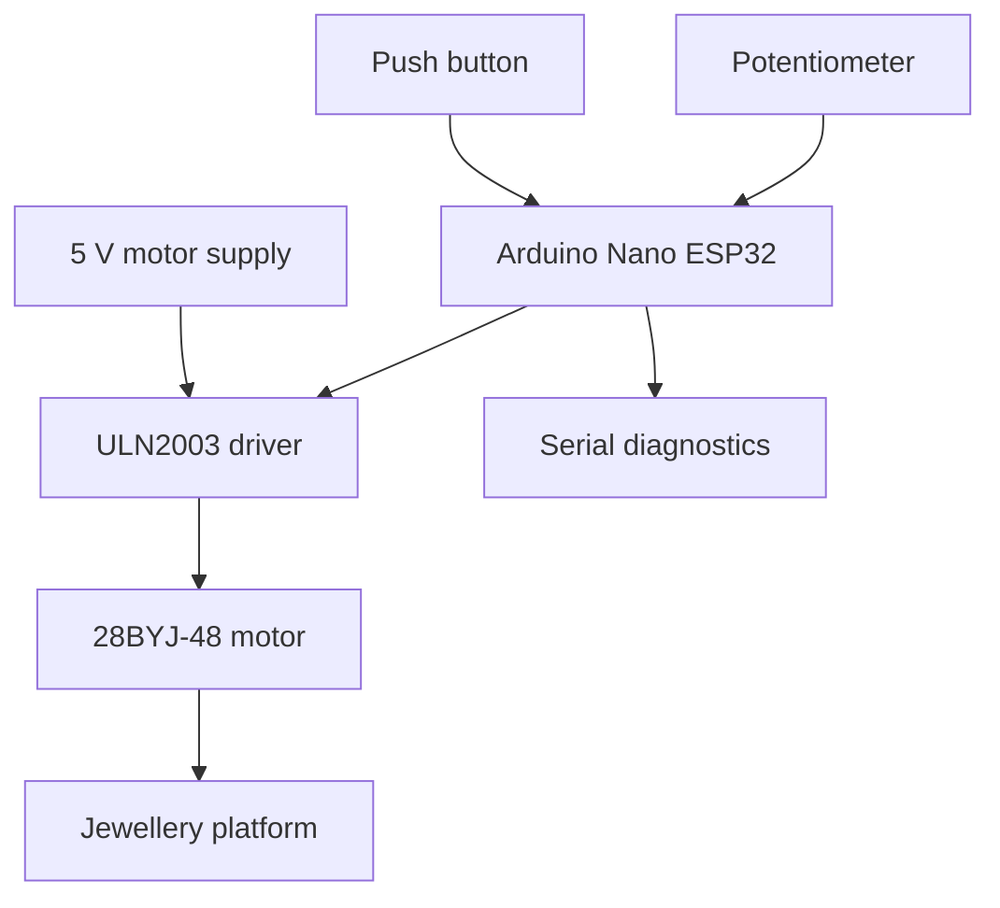
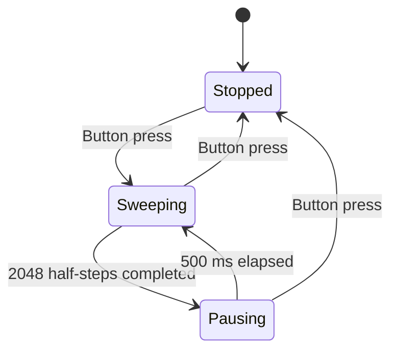

# Automated 180° Jewellery Photography Turntable

An Arduino Nano ESP32 (ESP32-S3) motion-control prototype for rotating jewellery during product photography and video recording. The firmware drives a 28BYJ-48 stepper motor through a ULN2003 driver, with adjustable speed and a push-button start/stop control.

**Author:** Shanmukh Jonnalagadda  
**Firmware:** `Jewellery_Project_180_degrees.ino`  
**Language:** Arduino C/C++

## Overview

The turntable alternates between a nominal 180° clockwise sweep and a nominal 180° anticlockwise sweep, pausing for 0.5 seconds after each sweep. This supports filming a product from changing viewpoints while keeping the camera stationary.

The motor starts in the stopped state. Pressing the button starts the sequence; pressing it again stops the motor and releases its coils. A potentiometer adjusts the stepping interval while the program runs.

This version automates platform movement. Camera recording is started separately, and this sketch does not implement Bluetooth, Wi-Fi, or automatic camera triggering.

## Implemented Features

- Eight-state half-step sequence implemented directly with digital outputs.
- 2048 commanded half-steps per sweep, based on the sketch's 4096-half-step revolution calibration.
- Automatic reversal after each sweep.
- 500 ms pause between sweeps, with motor coils released.
- Push-button start/stop toggle with 50 ms debounce.
- Analog speed control with a commanded interval of 1000–4000 microseconds per half-step.
- Timestamp-based stepping using `micros()` and pause/debounce timing using `millis()`.
- Serial diagnostics for operating state, direction, potentiometer reading, and sweep progress.
- No external libraries referenced by the sketch; it uses Arduino core functions.

## Hardware

| Component | Quantity | Function |
| --- | --- | --- |
| Arduino Nano ESP32 | 1 | ESP32-S3-based controller |
| 28BYJ-48, 5 V stepper motor | 1 | Rotates the platform |
| ULN2003 driver board | 1 | Switches the motor windings |
| 10 kΩ potentiometer | 1 | Adjusts rotation speed |
| Momentary push button | 1 | Starts and stops motion |
| 5 V, 2 A adapter | 1 | External motor supply |
| USB-C data cable | 1 | Controller connection and programming |
| Breadboard and jumper wires | As needed | Prototype connections |
| Base, rotating plate, and mounting materials | As needed | Mechanical assembly |

## System Architecture



## Wiring

| Component connection | Destination |
| --- | --- |
| ULN2003 IN1 | D2 |
| ULN2003 IN2 | D3 |
| ULN2003 IN3 | D4 |
| ULN2003 IN4 | D5 |
| Potentiometer wiper | A0 |
| Potentiometer outer terminals | 3.3 V and GND |
| Push button | Between D6 and GND |
| Motor connector | ULN2003 motor socket |
| Driver power input | External 5 V motor supply |
| Driver/supply ground | Common ground with the controller |

The code enables `INPUT_PULLUP` on D6, so a button press is detected as LOW. Use the board labels shown above; the source uses `D2`–`D6` and `A0`, rather than hard-coded raw GPIO numbers. Keep the potentiometer input within the controller's 3.3 V range. Power the motor through the driver, not a controller GPIO.

## Motion Sequence



The first sweep is labeled clockwise in the firmware. At the end of each sweep, the program resets the sweep counter, releases the motor coils, flips the direction flag, and begins the pause. Physical clockwise/anticlockwise orientation depends on the viewing side and wiring.

Stopping preserves the current step index, direction, sweep counter, and pause state. Starting again resumes the stored sequence; it does not reset the platform to a home position. A pause timer continues to age while stopped, so restarting during a pause does not necessarily provide a fresh 500 ms pause.

## Speed and Timing

The potentiometer reading is mapped as follows:

```cpp
unsigned long stepDelay = map(potValue, 0, 4095, 4000, 1000);
```

| ADC reading | Commanded half-step interval | Idealized 180° sweep duration |
| --- | ---: | ---: |
| 0 | 4000 µs | 8.192 s |
| 4095 | 1000 µs | 2.048 s |

These durations are calculated from 2048 steps at a fixed interval, excluding the 0.5-second pause and software overhead. They are not measured performance results. The mapping assumes ADC readings in the range 0–4095; the sketch does not explicitly set ADC resolution.

The main loop checks timestamps instead of using a blocking delay for every step. The sketch does contain a one-second initialization delay in `setup()`, and serial output can add execution overhead.

## Setup

1. Secure the motor and center the platform over its shaft. Check that the platform can turn without rubbing against the base.
2. Wire the driver and controls according to the table above, with power disconnected during assembly.
3. In Arduino IDE, install the board support for Arduino Nano ESP32 and select that board and its USB port.
4. Open `Jewellery_Project_180_degrees.ino`. For a conventional Arduino sketch folder, use `Jewellery_Project_180_degrees/Jewellery_Project_180_degrees.ino`; allow the IDE to create that folder if prompted.
5. Upload the sketch. No additional third-party library installation is required by this source file.
6. Open Serial Monitor at **115200 baud**. After initialization, the startup messages should indicate that the motor is stopped.
7. Test motion with the empty platform, then place a lightweight jewellery item near its center.
8. Press the button to start, adjust the potentiometer for the desired motion, and begin recording on the camera separately.
9. Press the button again to stop.

## Firmware Structure

| Function | Responsibility |
| --- | --- |
| `setup()` | Initializes serial output, motor pins, analog input, and button pull-up; releases the motor |
| `loop()` | Reads inputs, schedules steps and pauses, reverses direction, and prints diagnostics |
| `handleButton()` | Debounces the button and toggles the running state |
| `performStep()` | Writes one of the eight half-step patterns to the driver inputs |
| `releaseMotor()` | Sets all four motor outputs LOW |

The serial status line is printed approximately once per second and contains the motor state, direction flag, potentiometer value, and step counter. During a direction pause, the direction flag already represents the upcoming sweep.

## Configuration

| Setting | Value in this sketch | Purpose |
| --- | --- | --- |
| `STEPS_PER_SWEEP` | `2048` | Commanded half-steps per sweep |
| `DIRECTION_PAUSE` | `500` ms | Delay between sweeps |
| `DEBOUNCE_DELAY` | `50` ms | Button stability threshold |
| `Serial.begin()` | `115200` | Serial baud rate |
| Potentiometer mapping | `4000` to `1000` µs | Commanded half-step interval |

The firmware uses a nominal conversion of 4096 half-steps per revolution. Verify actual platform travel when changing the motor, drive sequence, or mechanical assembly.

## Limitations and Validation

This is an open-loop prototype: the controller counts commanded steps but does not measure platform angle. The serial message `RETURNED TO START POSITION` indicates completion of the reverse step count, not a sensor-confirmed home position.

Motor coils are released during pauses and when stopped, so the firmware does not actively hold position at those times. Manual movement, missed steps, or drivetrain play can affect the return position. The mechanical prototype has also shown tilt or wobble, making rigid mounting and centered loading important.

The source establishes the intended control behavior. Angular accuracy, load capacity, endurance, and speed under load require physical measurements; no numerical validation results are claimed here.

## Supporting Project Files

Useful additions alongside the firmware and README are:

- A wiring diagram in `docs/`.
- The project report in `docs/`.
- Photos of the assembled platform, motor mounting, and wiring in `images/`.
- A demonstration video showing a complete outward and return sweep, speed adjustment, and start/stop control.
- A sample jewellery video captured with the turntable.

## Future Improvements

- A bearing-supported platform and more rigid motor mounting.
- Acceleration and deceleration for smoother starts and reversals.
- A home-position sensor for establishing a repeatable physical reference.
- Automated camera triggering for step-and-capture photography.
- High-CRI lighting for consistent product illumination.
- Wireless controls in a separately documented firmware version.
- Measured angular repeatability and load-dependent motion tests.

## Skills Demonstrated

Embedded C/C++, digital and analog I/O, stepper-motor sequencing, timestamp-based scheduling, button debouncing, serial diagnostics, driver integration, and mechanical-electrical prototyping.
